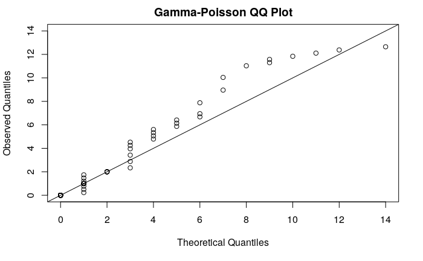

# pwrIRGP - Power Analysis for Interaction Rate Social Networks using a Gamma-Poisson model

This package can be used to estimate the accuracy of observed social networks built from interaction rate data. It uses a Gamma-Poisson model of interaction data to estimate the correlation between a sampled network and the true underlying network. The package also includes methods to conduct power analysis on nodal regression and to estimate the point at which increases in sampling effort lead to diminishing returns in accuracy.

If using this package, please cite the paper, which includes more detailed information about the methods:

Hart, J. D. A., Franks, D. W., Brent, L. J. N., & Weiss, M. N. (2021). Accuracy and Power Analysis of Social Interaction Networks. BioRxiv, 2021.05.07.443094. https://doi.org/10.1101/2021.05.07.443094

## How to use

### Installation

To install this package you'll need the `devtools` library, then you can install `pwrIRGP` using the `install_github` function.

```{r}
devtools::install_github("JHart96/pwrIRGP")
```

### Example

First import the package.

```{r}
library(pwrIRGP)
```

Simulate undirected network data with 8 nodes, 10 mean units of observation time per dyad, a social differentiation of 2, and a mean interaction rate of 0.5 interactions per unit time. Extract the symmetric square matrices for use in the `net_cor` function. This won't be necessary if you're using your own data.

```{r}
set.seed(1)
sim_data <- simulate_data_gp(8, 10, 2, 0.5)

X <- sim_data$X # 8 x 8 symmetric matrix of integer observation counts.
D <- sim_data$D # 8 x 8 matrix of positive real-valued sampling times.
```

Let's have a look at what X looks like:
```{r}
X
```
```
     [,1] [,2] [,3] [,4] [,5] [,6] [,7] [,8]
[1,]    0    0    2    0    2    2    0    0
[2,]    0    0    0    7    0    0    6   13
[3,]    2    0    0   12    5   14    1    0
[4,]    0    7   12    0    0    0    0    4
[5,]    2    0    5    0    0    1    0    1
[6,]    2    0   14    0    1    0    0    0
[7,]    0    6    1    0    0    0    0   11
[8,]    0   13    0    4    1    0   11    0
```

Use the two matrices `X` and `D` to estimate the correlation between the sampled network and the true, underlying network. This will provide both a summary table of several properties of the data as well as a QQ diagnostic plot to qualitatively verify that the data fit the Gamma-Poisson model.

```{r}
net_cor_obj <- net_cor(X, D)
net_cor_obj
```


```
                                Estimate     SE Lower CI Upper CI
Observed Social Differentiation    1.540     NA       NA       NA
Mean Interaction Rate              0.274     NA       NA       NA
Sampling Effort                    2.700     NA       NA       NA
Est. Interaction Rate              0.274 0.1060    0.137    0.549
Est. Social Differentiation        1.780 0.3450    1.230    2.580
Est. Correlation                   0.946 0.0287    0.869    0.979
```

The QQ diagnostic plot shows that the data fit the model well, with a slight deviation at the tail. We should be okay to proceed now.

The first three rows give the social differentiation, mean interaction rate, and sampling effort according to the observed data. The next three rows use the estimates from the Gamma-Poisson model to estimate the true interaction rate, social differentiation, and the correlation between the observed interaction rates and the true interaction rates.

If you want to conduct power analysis for nodal regression, you will need to extract social differentiation, interaction rate, and sampling times from the summary object and the data matrices. We also recommend to extract the confidence intervals of these to capture the uncertainty of the data. You will also need to provide an `effect` value. This is the effect size (correlation coefficient) and reflects the true relationship between the response and predictors in the regression (the effect size we'd see with perfect, infinite sampling). 

```{r}
social_differentiations <- net_cor_obj$summary[5, c(3, 1, 4)] # c(3, 1, 4) gives the lower CI, median, and upper CI.
interaction_rates <- net_cor_obj$summary[4, c(3, 1, 4)]
sampling_times <- D # Matrix of sampling times OR Single value of mean sampling times

# Calculate power of nodal regression for effect size r = 0.5
effect <- 0.5
pwr_nodereg(8, effect, social_differentiations, interaction_rates, sampling_times)
```

```
Running simulations...Done!

Number of nodes: 8
Effect size: 0.5
 Social Differentiation Interaction Rate Power
                   1.23            0.137 0.207
                   1.78            0.274 0.227
                   2.58            0.549 0.249
```

This shows us that we could expect a power of between 20.7 and 24.9% given the properties of the data and the true effect size = 0.5.

If a different type of analysis is being conducted such as network subsetting, the diminishing returns/elbow estimator could be used to determine if sufficient data are available:
```{r}
pwr_elbow(social_differentiations, rho_max=0.99) # Use rho_max=0.99 as in the paper.
```

```
Social Differentiation Sampling Effort Correlation
                   1.23            2.81   0.8997606
                   1.78            1.34   0.8996477
                   2.58            0.64   0.8999386
```

The elbow method says we need a sampling effort of between 0.64 and 2.81 to reach the optimal level of correlation, which is roughly 90%. From our run of `net_cor` we know that sampling effort is 2.7, which is lower than the 2.81 upper CI estimate. This indicates that in the worst case scenario, we probably have roughly the optimal amount of sampling for our level of social differentiation.

